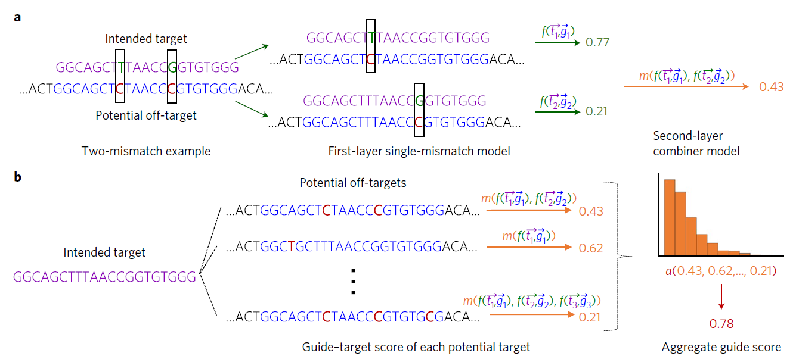

# Prediction of Prediction of off-target activities for the end-to-end design of CRISPR guide RNAs

## 摘要：

### 脱靶效应可导致次优基因编辑结果，是其发展的瓶颈。  

使用基于两个相互关联的**机器学习模型**的方法来预测脱靶效应---叫做Elevation。  

*对独立的guide-target 对进行评分，然后同时将他们合并为一个唯一整体总结指导分数。还提出了一张评估方法用于：平衡活动和非活动guide之间的误差*

## 背景：

减少脱靶影响最好的方式是：知道他们什么时候，在哪发生，并在平衡on-target效率的情况下设计一个指南来避免脱靶。

本文提出了基于机器学习的方法：   

基于机器学习的预测建模可以利用少量的数据来了解导致脱靶效应的gRNA-target序列对的统计规律，以及它们对细胞的总体影响。这种建模使得能够廉价和快速地在全基因组水平上筛选非试验前的gRNA的脱靶效应。  

## 本文方法：

对于脱靶预测建模有两种主要的用例：
1，了解给定的脱靶区域可能对特定的gRNA来说有多活跃，这个活跃性称之为gRNA-target评分。（对于关注基因组的特定区域来说是很有用的）
2，获得给定的gRNA的所有脱靶活性的总体得分，以获得基因的潜在gRNA排序。  

可以将脱靶预测模型问题分解成三个主要的任务：  

* 搜索并过滤全基因组以获得一个gRNA的潜在靶点。  （例如，基因组中与gRNA相匹配的区域中，可能有N个*目标位点*的核苷酸误匹配，这些位点将会在第二步以后才会被视为脱靶活性，使用机器学习去区分有活性的和无活性的targets。在这一步只会创建一个潜在活性位点的简短列表。）
* 对每一个潜在活动目标进行评分，给gRNA-target对分配一个数值，来表示一个gRNA-target对预计有多少脱靶效应。  
* 对（2）中的分数进行合并，得到一个单独的脱靶可能性，用于评估gRNA。

在第一步的搜索和过滤任务中，可以使用数值方法：Cas-OFFinder, CRISPOR, CHOP-CHOP,
e-CRISPR， CRISPR-DO, CROP-IT and COSMID。（所算法使用的搜索算法不同，以及有着不同的*搜索完整性*。）  

**搜索完整性：取决于诸如最大不匹配数量，允许的原型间隔符相邻基序（PAM）和所使用的搜索算法。**  

本文中，在第一步中使用了自己的系统作为搜索和过滤操作----*Elevation-search*。  

第二步和第三步使用所提出的---脱靶的端对端建模方法为**Elevation**  ：

* 对于gRNA-target评分：开发出一个**双层回归模型**（**Elevation-score**）：  
  * 第一层学习预测单个错配（target与预期的target之间，因此也包括替代的PAM）脱靶活性。
  * 第二层模型学习如何将来自具有多个错配的gRNA-target对的单错配模型的预测组合成单个gRNA-target得分—-**‘combiner’模型**。  
* 为了汇总guide的单个评分：
  * 首先将gRNA-target评分模型应用于潜在的target列表（通过Elevation搜索列出）。
  * 然后再使用Elevation-汇总模型来对单个的评分进行汇总。
    *Elevation模型：考虑每一个潜在的target是否位于基因中，并允许这些特征和其他特征通过非线性建模方法（**boosted 回归树**）相互作用。    

下图为Elevation脱靶预测模型的框架图：  

* 第一层*a*：
  * 首先gRNA-target对被分解为两个单个误匹配pseudo-pairs（{}$t_1,g_1$},{$t_2,g_2$})，每一对可以通过第一层（单个误匹配）模型来获得评分$f$。
  * 然后这些单个的评分通过第二层模型进行组合，生成一个解释所有误匹配的单个gRNA-target评分。  
* 第二层*b*：  
  * 计算gRNA-target评分的输入分布的统计作为特征，并通过模型运行产生一个gRNA的聚合评分。

  

### 特征选择：

对于第一层（单个误匹配）特征选择：  

* 误匹配的位置.
* 误匹配的nucleotide（核苷酸）一致性(the nucleotide identity）.
* 单个特征中无匹配的联合位置和身份.
* 突变是否是一个转换或者颠换。  

第二层（多个误匹配组合器）模型：

* 特征重要性显示误匹配的总数，以及第一层单个误匹配预测的总和在驱动了这个模型。  

**聚合的最后任务：获得对于一个gRNA所给定的所有单个gRNA-target评分的单个脱靶总结评分。该任务的解决方案对于gRNA的设计非常有用，在于用户想要扫描大量的gRNA的总体活性。**   

*细胞的活力部分由每个细胞的DNA断裂数决定。第二个对活性的影响是在一个关键基因上的脱靶活性。*

------------------------------------------

核染色质开放性--真核生物染色质DNA在核小体或转录因子等蛋白与其结合后，对其他蛋白能否再结合的开放程度。这一特征反应了染色质转录活跃程度。（这部分不太清楚，应该是在介绍核染色质对实验的影响？）

-----------------------------------------------------------------------

## 研究方法：

### 数据：

* 训练第一层，使用CD33数据。
* 评估第二层，使用两个无偏/全基因组多误匹配数据集。

### 单个gRNA靶对评分的预测模型：  

先介绍CFD模型所作出的假设，再描述Elevation评分模型以及他怎么在概念上与CFD相关联的。  

#### CFD模型（预测脱靶模型）：

* 首先计算CD33数据中每种单个错配类型的gRNA-target对活性的*观测频率（observed frequency）*。

* 然后针对有多个误匹配的gRNA-target对，CFD通过将单个错配频率*乘到*一起进行组合。

  * 例如，如果gRNA-target对在位置3处有A：G误匹配，在位置5处有T：C误匹配，并且在目标区域有“CG”的PAM存在，则CFD将会计算这个gRNA的脱靶评分为：$CFD \ score=P(active | A:G,3) \times P(active | T:C,5) \times P(active | CG)$  

    这些项每个都是根据CD33训练集数据中（只包含单个误匹配或备用PAM，但是不会同时包含两者）观察到的频率来计算的。    

* CFD作为**朴素贝叶斯**：可以把CFD算法解释为分类模型---朴素贝叶斯。  

  * $Y=1$表示一个gRNA-target对有活性，$Y=0$表示这个对没有活性。

  * 用$X_i$表示特征比如（T:G，5），$i$简单的指示了这些特征的枚举（即一个one-hot编码）。如果特征（误匹配）发生----$X_i=1$，如果没有发生----$X_i=0$。因此，在CD33数据集中（只有单个误匹配），一个特殊的gRNA-target对仅有一个$X_i=1$，其他的都为$X_i=0$。在这个定义下，可以重写针对一个gRNA-target对的CFD为：$CFD=\prod_{i\in\{i | X_i=1\}} \ P(Y=1 | X_i=1)$。  

    贝叶斯模型将会计算在给定的特征值下，一个gRNA-target对是有活性的概率为：

    $Naive Bayes \equiv P(Y=1 |\{X_j\})=\frac{P(Y=1)}{P(\{X_j\})}) \prod_i P(X_i | Y=1)$      

    其中，$X_j$为所有特征$X_i$的集合。假设在gRNA是有活性的情况下，特征$X_i$是独立的使得：$P(\{X_j\}|Y=1)=\prod_iP(X_i|Y=1)$。使用Bayes规则，可以重写朴素贝叶斯分类器为：

    $NaiveBayes\equiv P(Y=1|\{X_j\})=\frac{P(Y=1)}{P(\{X_j\})}\prod_iP(Y=1|X_i)\frac{P(X_i)}{P(Y=1)}=\frac{1}{P(\{X_j\})}\prod_iP(Y=1|X_i)P(X_i)$  

    如果做出两个更近一步的假设，会发现朴素贝叶斯分类器恰好与CFD匹配。*第一个假设*假设特征略微独立，也就是说：$\prod_iP(X_i)=P(\{X_j\})$，在这种情况下，朴素贝叶斯可以简化为：  

    $NaiveBayes_{feat.ind.}=\prod_iP(Y=1|X_i)$    

    在Elevation-score中也可以做出同样的假设。如果假设$P(Y=1|X_i=0)=1$，那么CFD和朴素贝叶斯将会是独立的。关键的问题是询问训练数据集的那些属性能够推广到模型可能应用的不可见数据集中。特别地，可以有理由的假设$P(Y=1|X_i=1)$是一个可以推广到其他数据集的quality。这个quality反映了我们观察到一种特定类型的不匹配的情况下gRNA的活跃可能性。因此他与在训练与测试集中不匹配类型的分布无关。定义了在没有观察到特征的情况下，gRNA是活跃的可能性。

    CFD假设为$P(Y=1|X_i=0)=1$。

    

  #### Elevation-score作为两层堆栈回归：  

  可以从CFD中推广出三种主要的方式：  

  * 使用回归代替分类器。
  * 增大了特征空间。
  * 组合使用机器学习方法取代了乘法结合概率的先验方法。  

  模型值执行前两步，具体方法为：

  * 首先将CD33LFC数值转换为位于范围内。他们可以被解释成概率，再使用核密度估计器将每个LFC变换成核密度估计中的LFC的累积密度。在这里使用**高斯核**并通过**tenfold cross-validation（十倍交叉验证）**来选择频率长度。
  * Elevation-score被分为两层：
    * 第一层对gRNA-target对中的单个误匹配进行预测（*第一层单个误匹配回归模型*）$p(y|\{X_j\})$：
      * 使用**boosted regression trees（boosted回归树）**（使用scikit-learn库的默认配置）在CD33数据集上执行。由于每个gRNA-target对在这些数据上只有一个$X_i=1$，也可以使用**线性回归模型**来进行预测。但是希望gRNA-target对更加丰富。因此希望这些特征能够在一个**非线性方法**中相互影响。特别地，会使用特征的“解耦”版本，比如编码形式之一‘A:G’----这是one-hot。还有其他位置的整数特征。CFD是将这些组合在一起作为一个单独的特征。还包括突变是否是颠倒或过渡。使用这些改进的并组合每一个误匹配的模型，正如CFD所作的将这些值相乘一样----Elevation-naive。
    * 第二层组合这些多个误匹配：  
      * 我们将Elevation-score的第二层作为组合器，因为它学习如何以更细致的方式将来自单个不匹配模型的预测结合起来，而不是简单地将它们相乘，从而允许减轻某些陈述的假设。 使用**数据驱动及其学习方法**来调整如何去组合他们。使用第一层boosted回归树模型J次来对J个单个gRNA-target对进行预测（也就是说，J个特征有着$X_j=1$），产生J个预测$\hat{y}_i \in [0,1]$(每一个特征有$X_j=1$,并且针对剩余的K个有着的$X_k=0$特征设置$\hat{y}_k =1$)。每一个gRNA-target对有$T=J+K=21$个boosted回归树预测。（20个可能的误匹配位置和一个PAM）作为特征。这21个特征的$log$:$\{log(\hat{y_t})\}$以及他们的总和，乘积和J（误匹配数和PAM数）作为第二层模型**L1正则线性回归**模型的输入。
      * 最后，因为我们最终想要的是对gRNA-target对进仓库有效的可能性的预测，我们还要对来自**L1回归组合器模型**的输出应用了一个最终变换。通过一个**校准模型**来转换输出。  
        * 校准模型使用**逻辑回归模型**使用Elevation-naive训练得到的预测作为输入来估计$P(active|GUIDE \ - \ seq \ normalized \ counts)$，然后使用相对应的二值观测活性（LFC>1)作为目标变量。-----只有回归的表现会影响这个转换，同gRNA-target评分无关。（即使是很简单的线性变换也可能会改变聚合分数。）  

  #### Elevation-聚合：    

  Elevation-score值提供了选择具有最小期望脱靶活性的gRNA的初始条件。*最终的结果需要将多个值聚合成一个以进行排序。* 

  * 开发一个基于**梯度boosted回归树**的模型来执行Elevation-aggregate。超参数的设置选择通过使用一个*随机搜索*的*交叉验证*方法：$losses ∈ {least \ squares; least \ absolute \ deviation; Huber}$,$learning \ rates \in [1.0 × 10−6, 1.0]$ 在在对数空间中等间隔的100点,$the \ number \ of \ estimators \in [20, 50, 80, 100, 200, 300, 400, 500]$, 最大树深范围为 1 到 7, 最小分割样本数量 = [2, 3, 4], $splitting \ criterion \in  [Friedman \ mean-squared \ error, mean-squared \ error, mean absolute \ error]$.

  

  

  

  

  

